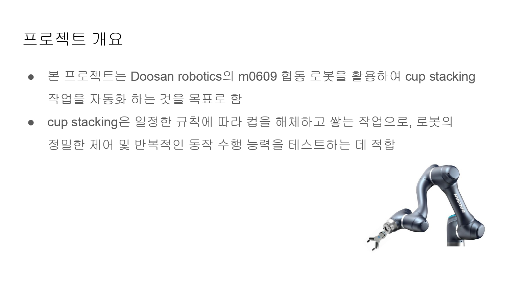
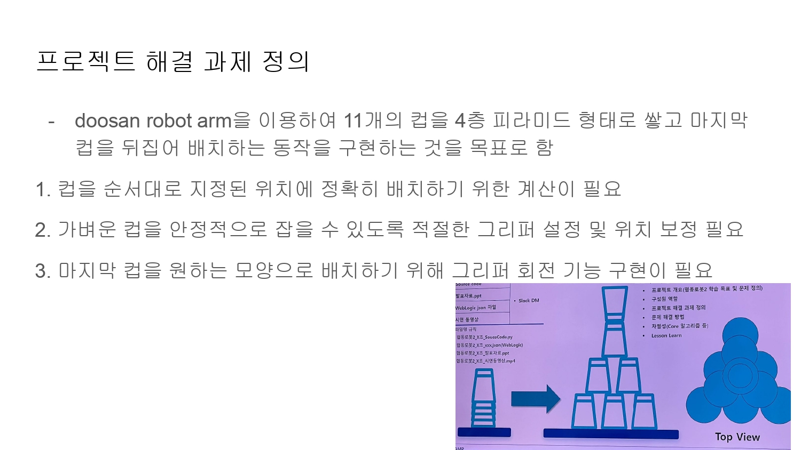
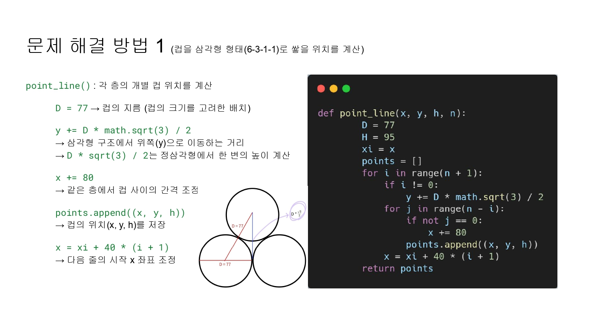
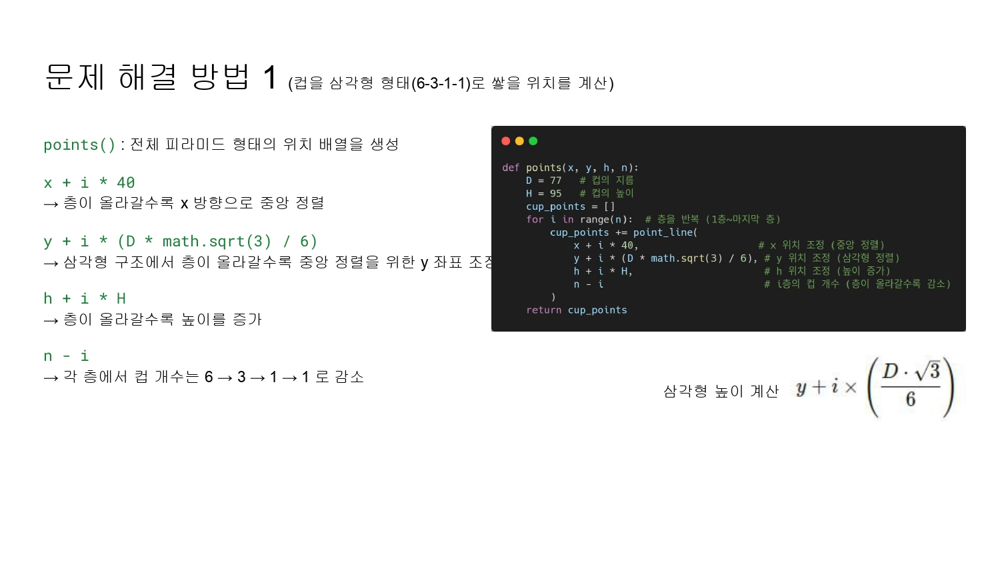
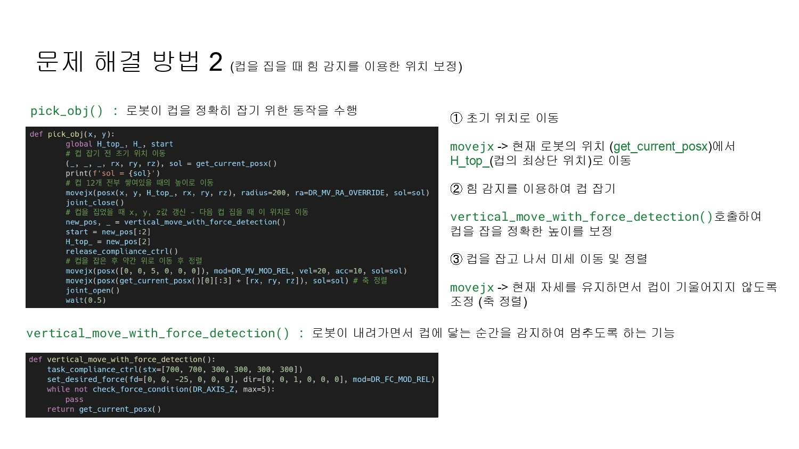
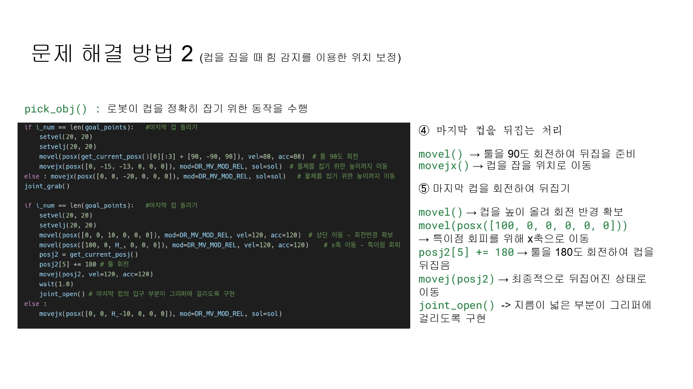
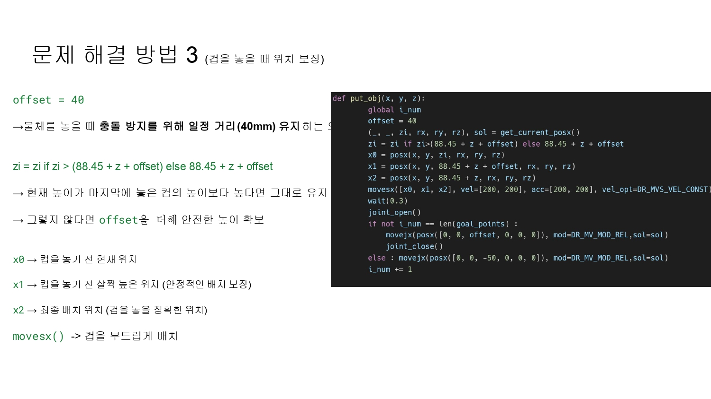
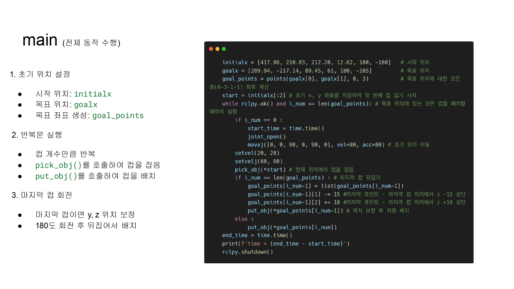
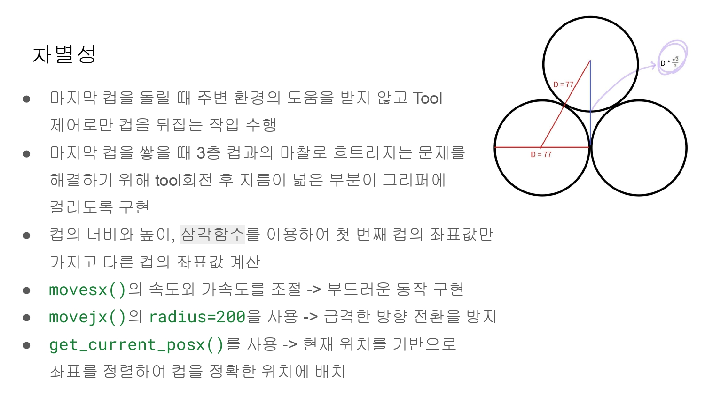

# ⚙️ Gear Assembly & Sport Stacking Task — Collaborative Robot Automation

이 프로젝트는 두산 협동 로봇을 활용하여 기어 조립 작업과 3×3 형태 팔레트에 블록을 길이 순서대로 배치하는 Sport Stacking 작업을 자동화하는 것을 목표로 합니다.

## 🎥 프로젝트 데모 영상

[

---

## 📌 프로젝트 개요

- **목적**  
  - 협동 로봇을 이용해 반복적이고 정밀한 조립 및 배치 작업 자동화  
  - 다양한 작업 환경에 맞춘 로봇 모션 최적화 및 안전성 확보  
  - 산업 현장 내 협동 로봇 활용 방안 탐색

- **주요 작업**  
  - 11개의 컵을 4층 피라미드(6-3-1-1) 형태로 쌓고 마지막 컵을 뒤집어 배치  
  - 3×3 팔레트에 블록을 길이 순서대로 정렬하여 배치  
  - Sport Stacking: 빠르고 정확한 컵 쌓기 및 해체 작업

---

## 🛠 주요 기술 및 방법

- **로봇 제어**  
  - Doosan 협동 로봇 M0609 모델 기반  
  - 6자유도 이상의 정밀 관절 제어  
  - 힘 감지 센서를 활용한 위치 보정 및 안정적 집기 동작

- **좌표 계산**  
  - 삼각함수를 이용한 컵 및 블록 위치 산출  
  - 층별 중앙 정렬 및 높이 보정 알고리즘 적용

- **동작 최적화**  
  - `movejx()`, `movel()` 함수 사용해 부드럽고 안전한 모션 구현  
  - 그리퍼 회전 기능으로 마지막 컵 뒤집기 작업 수행  
  - 충돌 방지를 위한 오프셋 거리 유지

---

## 🔄 작업 흐름

1. 초기 위치 설정 및 목표 좌표 생성  
2. 반복문으로 각 컵/블록 순서대로 집기 및 배치 수행  
3. 마지막 컵/블록에 대해 회전 및 뒤집기 동작 수행  
4. 전체 작업 종료 후 초기 위치 복귀

---

## 💡 차별성 및 학습 포인트

- 주변 환경 도움 없이 그리퍼 제어만으로 마지막 컵 뒤집기 구현  
- 물리적 접촉과 마찰을 고려한 안정적인 쌓기 작업  
- ROS2와 Python을 활용한 협동 로봇 소프트웨어 개발 경험  
- 실제 산업 현장 적용 가능성을 고려한 예외 처리 및 안전 로직 고민

---

