# 🤖 Multi-Robot Autonomous Cooperation Simulation Using RVIZ2 & Gazebo

본 프로젝트는 ROS2 기반으로 TurtleBot3 및 드론을 활용한 다중 로봇 협력 자율 주행 시뮬레이션 환경을 구축하고 제어하는 시스템입니다.  
Gazebo 시뮬레이터와 RVIZ2를 통해 센서 데이터 시각화, 경로 계획, 협업 및 원격 제어 기능을 구현하여 복잡한 구조 환경에서의 로봇 협업 가능성을 탐구합니다.

---
## 🚀 실행 방법 
  ```sh
  ros2 launch sjtu_drone_bringup project_sjtu_drone_bringup.launch.py
  ```
  - 드론 **스폰, Gazebo, RViz2, Teleop 실행**

  ```sh
  ros2 launch rescue_turtlebot3_bringup map_world_nogazebo.launch.py
  ```
  - **드론과 함께 실행**하는 모드 (Gazebo 미포함)

  ```sh
  ros2 launch rescue_control rescue_control_launch.launch.py
  ```
  - camera_openCV
  - GUI

  ```sh
  ros2 launch rescue_turtlebot3_bringup map_world_nogazebo.launch.py
  ```
  - **드론과 함께 실행**하는 모드 (Gazebo 미포함)

  ```sh
  ros2 run rescue_turtlebot3_bringup spawn_ran
  ```
  - 목표물 랜덤위치 spawn


  ```sh
  ros2 run sjtu_drone_control drone_obj_tracker
  ```
  - 목표뮬 발견 시 드론 출발

  ```sh
  ros2 run rescue_control send_waypoint
  ```
  - waypoint 순환

## 📁 패키지 개요

### 1. sample_pkgs  
- 강사님 제공 패키지 (참고용)

### 2. rescue_control  
- **역할:** 각종 메시지를 수신하고 컨트롤 타워 역할 수행  
- **주요 실행 명령어:**  
  ```sh
  ros2 run rescue_control send_waypoint
  ```
  - `send_waypoint` : TurtleBot3의 웨이포인트 지정
 
  ```sh
  ros2 run rescue_control GUI
  ```
  - `GUI` : 관제 시스템 실행

### 3. rescue_turtlebot3_bringup  
- **역할:** TurtleBot3의 Gazebo 및 RViz2 실행, 스폰 관련 기능 제공  
- **주요 실행 명령어:**  
  ```sh
  ros2 launch rescue_turtlebot3_bringup map_world.launch.py
  ```
  - Gazebo, RViz2에서 **TurtleBot3 단독 실행**  

  ```sh
  ros2 launch rescue_turtlebot3_bringup map_world_nogazebo.launch.py
  ```
  - **드론과 함께 실행**하는 모드 (Gazebo 미포함)  

  ```sh
  ros2 run rescue_turtlebot3_bringup spawn_ran
  ```
  - **더미(random) 스폰 실행**

### 4. sjtu_drone_description  
- **역할:** 드론의 URDF, CAD 파일, World 파일 제공  

### 5. sjtu_drone_bringup  
- **역할:** 드론의 Gazebo 및 RViz2 실행, 스폰 기능 제공  
- **주요 실행 명령어:**  
  ```sh
  ros2 launch sjtu_drone_bringup project_sjtu_drone_bringup.launch.py
  ```
  - 드론 **스폰, Gazebo, RViz2, Teleop 실행**

### 6. sjtu_drone_control  
- **역할:** 드론의 Teleop 및 제어 기능 수행  
- **주요 실행 명령어:**  
  ```sh
  ros2 run sjtu_drone_control drone_obj_tracker
  ```
  - **목표물 발견 시 드론 출발**하는 기능 실행
  
  ```sh
  ros2 run sjtu_drone_control drone_amcl_follower
  ```
  - **드론 turtlebot3 실시간 추적**하는 기능 실행  

---

## 📂 주요 코드 설명

### `GUI.py`  
- PySide2 기반 GUI로, TurtleBot3 및 드론 위치 시각화와 원격 제어 기능 제공  
- 로봇 위치 정보를 RViz2와 연동해 실시간 모니터링 가능  

### `camera_openCV_nav2.py`  
- RGB 카메라 영상에서 빨간색 조난자 객체 탐지  
- OpenCV 기반 영상처리 및 ROS2 이동 명령 퍼블리시  
- Nav2를 활용해 자동 내비게이션 기능 연동  

### `coordinate.py`  
- 사전 정의된 미션 수행용 웨이포인트 좌표를 관리하는 모듈  
- 여러 로봇 동시 임무를 위한 좌표 집합 제공  

### `send_waypoint.py`  
- Nav2 FollowWaypoints 액션 클라이언트를 구현  
- TurtleBot3 및 드론에 웨이포인트 경로를 전송 및 순환 제어  

### `simple_move.py`, `simple_move_0pos.py`  
- 로봇팔 기본 관절 각도 제어 테스트 스크립트 (예제용)  

### `spawn_robot.py`  
- Gazebo 시뮬레이터 내 로봇 스폰 요청 및 초기화 수행  

### `drone_amcl_follower.py`  
- AMCL 기반 드론 위치 추적 및 TurtleBot3 추종 기능 구현  

### `drone_obj_tracker.py`  
- YOLOv8 기반 드론 객체 탐지 및 위치 제어  
- 목표물 발견 시 이륙 및 추적 수행  

### `drone_position_control.py`  
- 드론 위치 목표 설정 및 이동 명령 실행  

### `open_loop_control.py`  
- 사전 정의된 동작 시퀀스 기반 드론 오픈 루프 제어  

### `teleop.py` / `teleop_joystick.py`  
- 키보드 및 조이스틱 입력을 통한 드론 수동 조종 인터페이스 제공  

---

msgs
노드 네임스페이스 및 토픽 정리
==================================
1. **/simple_drone/simple_drone**
   - **Publish:**
     - `/simple_drone/cmd_vel` → [geometry_msgs/msg/Twist]
   - **Subscribe:**
     - `/simple_drone/gt_pose` → [geometry_msgs/msg/Pose]
     - `/simple_drone/gt_vel` → [geometry_msgs/msg/Twist]
2. **/simple_drone/teleop_node**
   - **Publish:**
     - `/simple_drone/cmd_vel` → [geometry_msgs/msg/Twist]
   - **Subscribe:** (없음)
3. **/simple_drone/bottom & front**
   - **Publish:**
     - `/simple_drone/camera_bottom/image_raw` → [sensor_msgs/msg/Image]
     - `/simple_drone/camera_bottom`
       `/simple_drone/bottom/camera_info` → [sensor_msgs/msg/CameraInfo]
   - **Subscribe:** (없음)

---
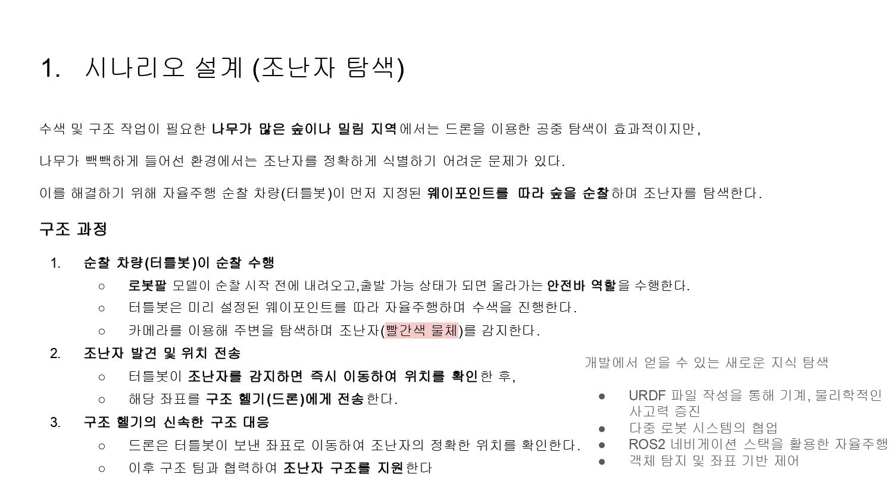
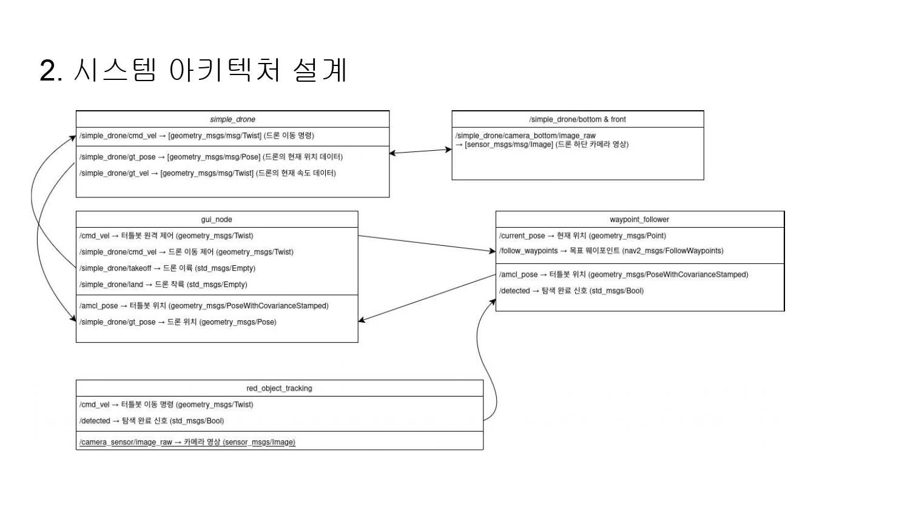
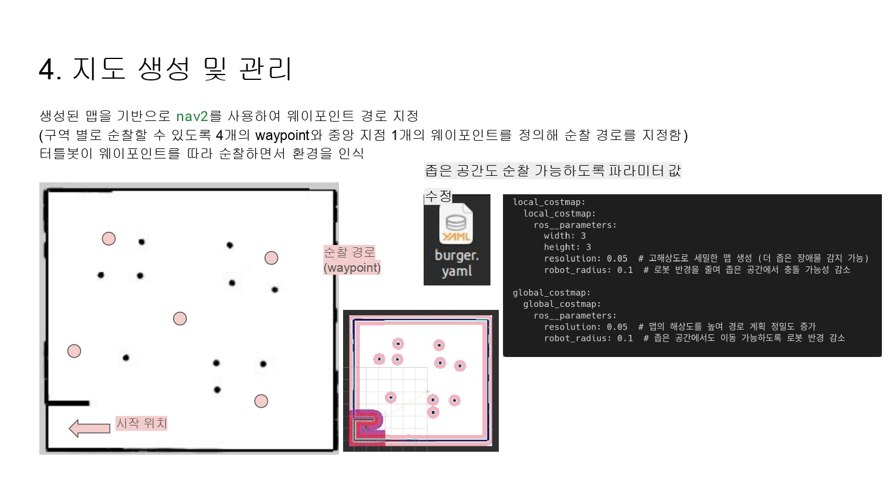
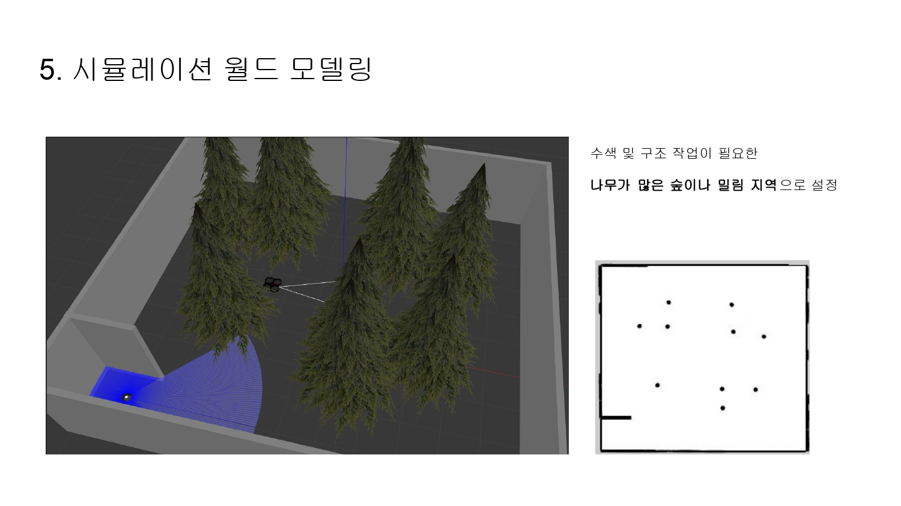
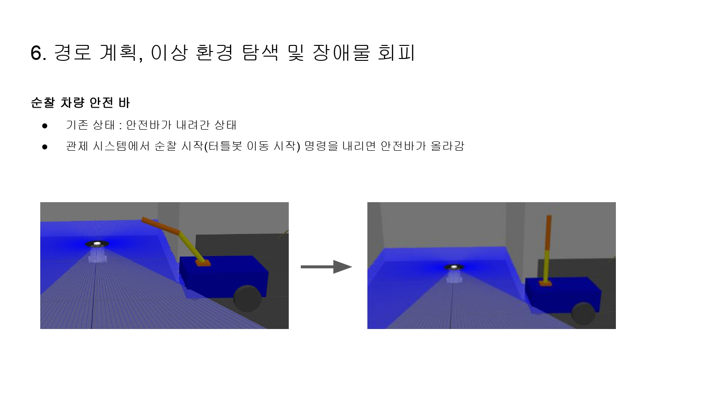
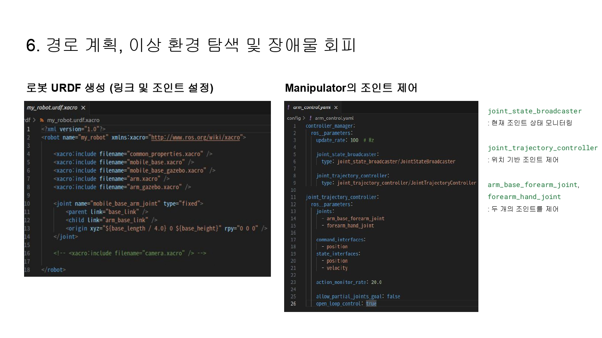
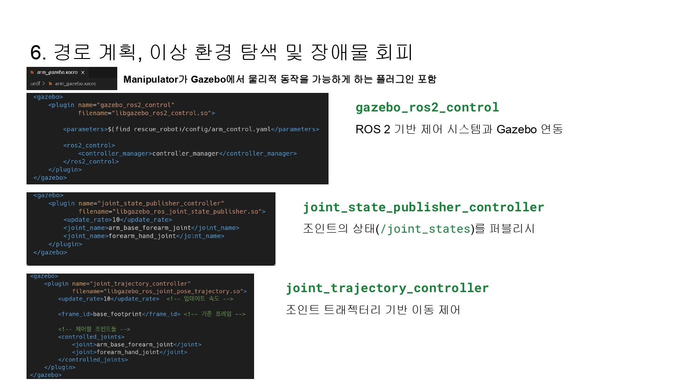
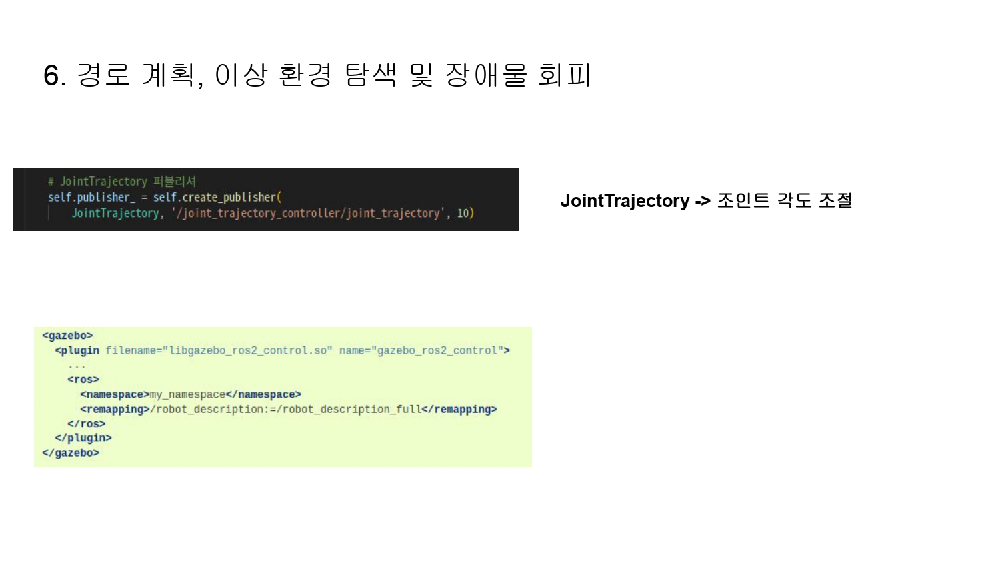
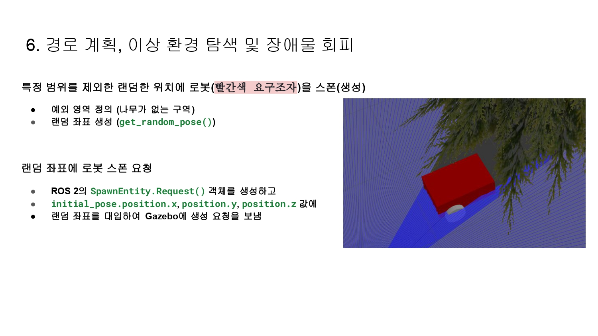
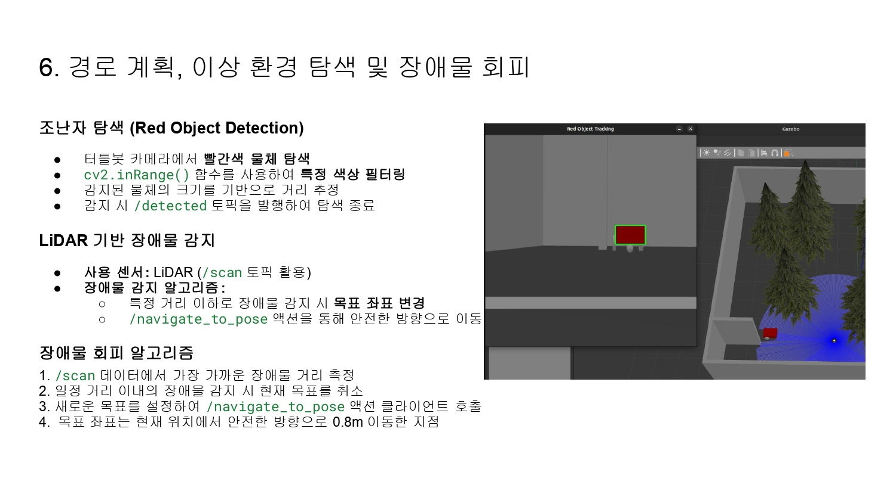
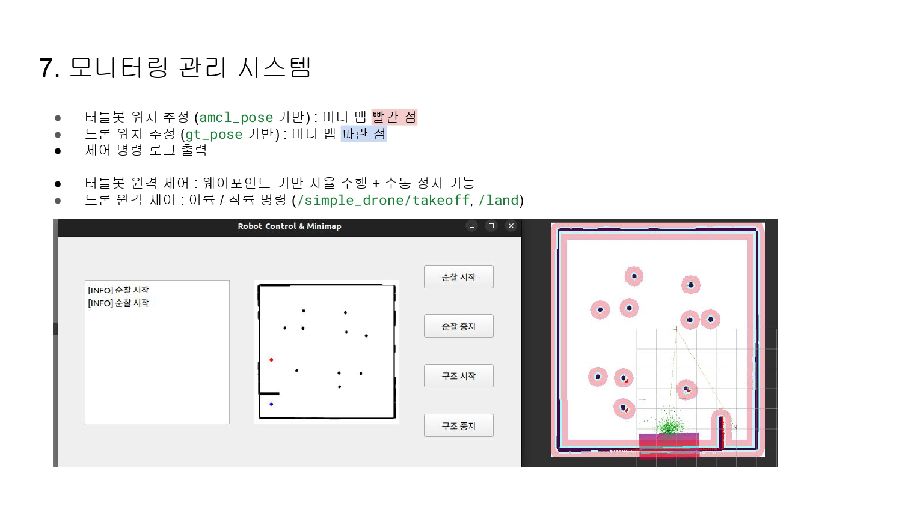
